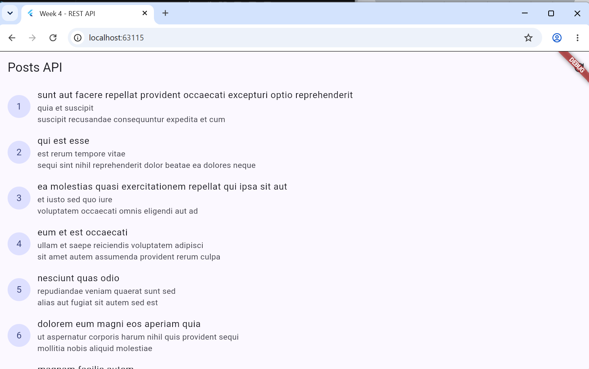
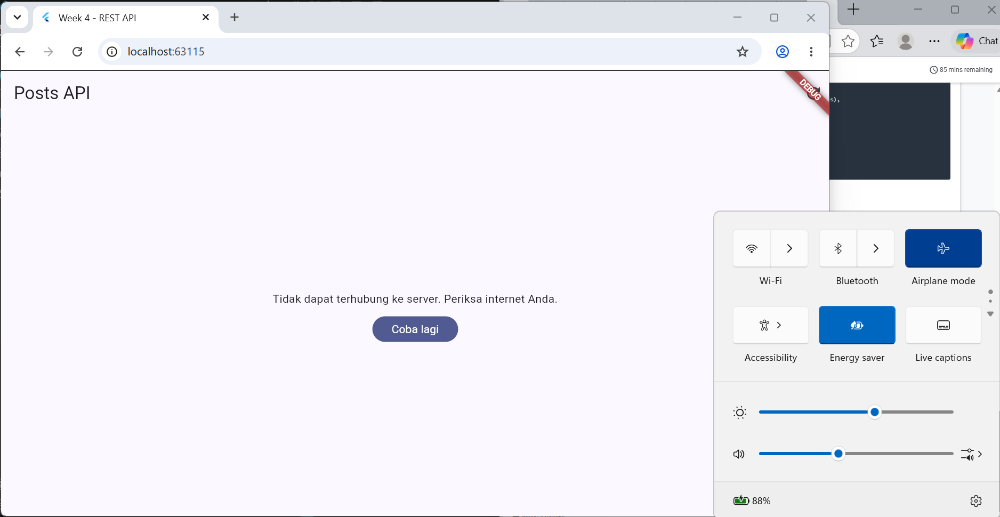
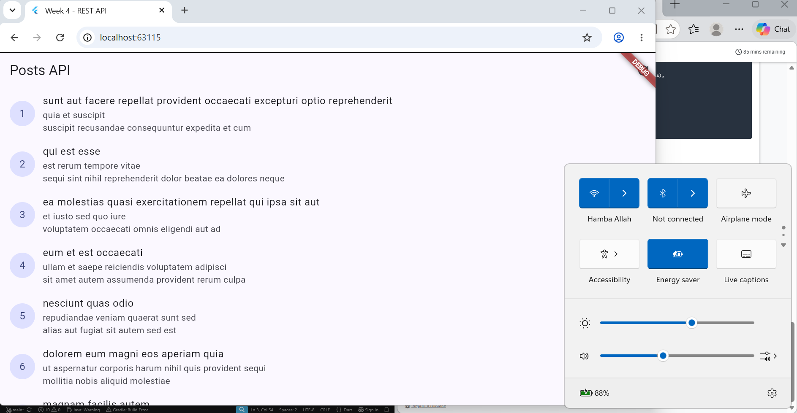
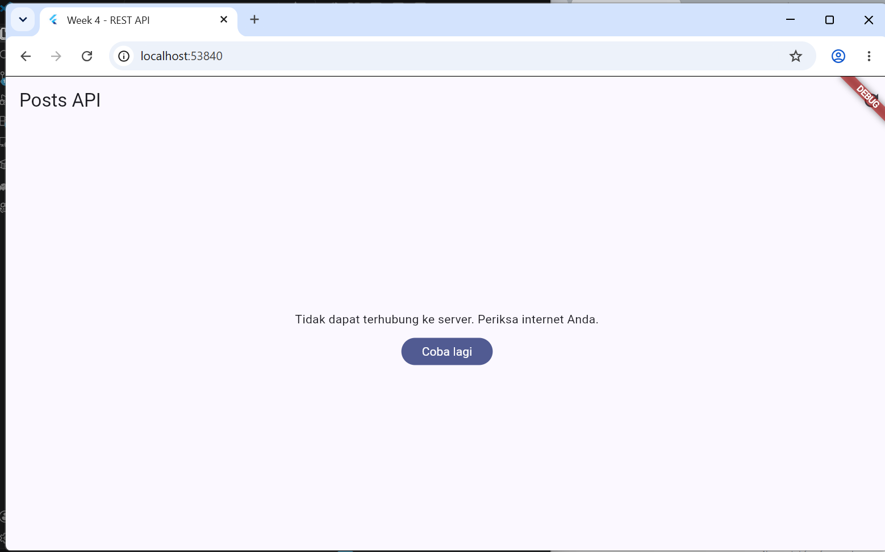
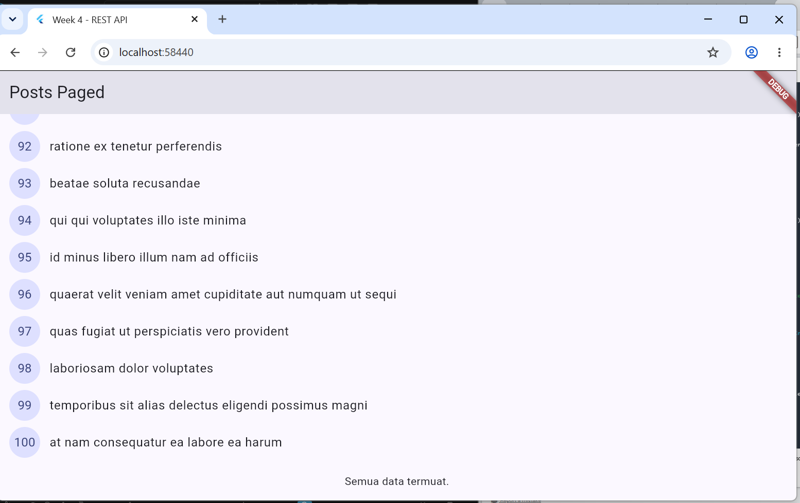
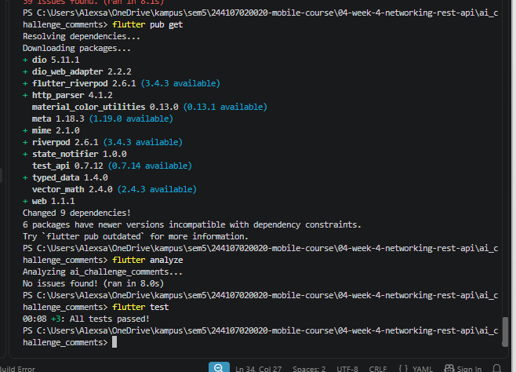
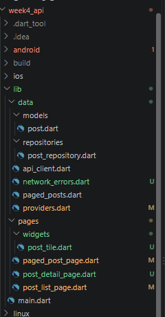
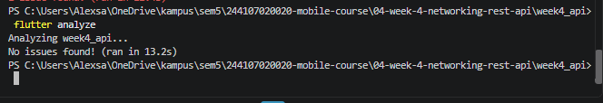
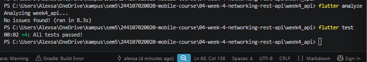

# **Uji tiga skenario error**

---

### 1.Jalankan aplikasi dengan internet normal, amati loading lalu daftar 100 posts.

**Bukti:**

### 2. Matikan internet (mode pesawat), tekan refresh, amati pesan ramah + tombol Coba lagi. Nyalakan kembali internet, tekan Coba lagi.

**Bukti 1 (Saat Internet Dimatikan / Mode Pesawat Aktif):**

**Bukti 2 (Setelah Internet Dinyalakan Kembali & Tekan Coba Lagi):**

### 3. Sementara ubah baseUrl menjadi URL salah, amati pesan error koneksi. Kembalikan setelah uji.

**Bukti:**

# **Praktikum 3**

---

### Ubah home di main.dart menjadi PagedPostPage, jalankan, dan scroll sampai bawah. Amati: halaman 1 tampil dulu, indikator muncul, data bertambah tanpa reload penuh.

**Bukti:**

# **AI Verification Checklist**

---
### 1. Apakah UI memanggil Dio secara langsung (dilarang) atau lewat repository?
Jawaban: Lewat repository (CommentRepository). ✅

### 2. Apakah fromJson aman null, atau masih memakai cast langsung yang bisa crash?
Jawaban: Ya, menggunakan defensive casting seperti (json['postId'] as num?)?.toInt() ?? 0. ✅

### 3. Apakah semua tipe DioExceptionType (timeout, connectionError, badResponse) dipetakan ke pesan pengguna?
Jawaban: Ya, ada friendlyErrorMessage yang menangani timeout, connectionError, dan badResponse. ✅

### 4. Apakah baseUrl/timeout terpusat di satu client, bukan tersebar di tiap method?
Jawaban: Ya, baseUrl ada di api_client.dart, tapi timeout masih tersebar di dalam method fetchComments. ⚠️ 
sudah diperbaiki. ✅

### 5. Apakah test AI benar-benar menguji kasus field hilang, atau hanya happy path? Tambahkan minimal 1 edge case sendiri.
Jawaban: Ya, ada test dengan json = <String, dynamic>{}. ✅

### 6. Jalankan flutter analyze dan flutter test, apakah hasil AI lolos tanpa warning?
Jawaban: Ya, lolos tanpa warning. ✅
**Bukti**

# **Refactoring Challenge**

---
### 1. Ekstrak Widget `PostTile`
Widget baris post (`ListTile`) yang sebelumnya ditulis langsung di `post_list_page.dart` dan `paged_post_page.dart`, kini diekstrak menjadi widget tersendiri bernama `PostTile` di file `lib/pages/widgets/post_tile.dart`. Ini membuat `ListView.builder` menjadi lebih pendek dan mudah diuji.

### 2. Pindahkan `friendlyErrorMessage`
Fungsi `friendlyErrorMessage` yang sebelumnya ada di `providers.dart`, kini dipindahkan ke file terpisah `lib/data/network_errors.dart`. Ini memungkinkan fungsi tersebut dipakai ulang oleh halaman paged (`paged_post_page.dart`) maupun non-paged (`post_list_page.dart`).

### 3. Tambahkan Halaman Detail Post
Halaman detail post (`lib/pages/post_detail_page.dart`) ditambahkan untuk menampilkan `title` dan `body` lengkap dari sebuah post. State detail diambil dari list yang sudah dimuat.

### Bukti Refactoring

**Struktur Folder Setelah Refactoring:**

**Hasil `flutter analyze`**

**Catatan:** `flutter analyze` menunjukkan `No issues found!`, yang berarti seluruh kode refactoring sudah bersih dari error dan warning.

# **Testing: Unit Test Model + Mock Repository**

---
**Hasil `flutter analyze dan fultter test`:**

# **Checklist Verifikasi Mandiri **

---
Berikut adalah hasil verifikasi mandiri untuk Praktikum Week 4:

- [x] UI tidak memanggil Dio langsung, semua akses data lewat repository + provider.
- [x] Empat state tampil benar: loading, error (+ retry), empty, success.
- [x] Pagination: data bertambah saat scroll, tidak ada request ganda, ada indikator akhir data.
- [x] `flutter analyze` tanpa issue dan semua test lulus.
- [x] Hasil AI diverifikasi dan didokumentasikan pada folder `docs/`.

# **Refleksi**

---

1. **Kenapa UI dilarang panggil Dio langsung?**  
   Supaya UI tidak tahu urusan jaringan. Kalau dilanggar, kode jadi susah di-test dan error handling tersebar di mana-mana. Akses data harus lewat repository + provider.

2. **Kapan pagination client-side cukup, kapan harus server-side?**  
   Client-side cukup kalau data masih sedikit. Kalau data sudah besar (ratusan/ribuan), harus pakai server-side (`_page` / `_limit`) biar tidak berat dan lambat.

3. **Bagaimana exception repository jadi `AsyncError` tanpa try/catch di widget?**  
   Riverpod otomatis menangkap exception dari `AsyncNotifier` dan mengubahnya jadi `AsyncError`. `try/catch` eksplisit tetap dipakai kalau butuh penanganan error khusus (misal pesan berbeda per tipe error).

4. **Bagian mana dari hasil AI yang diperbaiki, dan kenapa?**  
   Saya pindahkan konfigurasi timeout dari `comment_repository.dart` ke `api_client.dart`. Tujuannya agar semua konfigurasi API terpusat di satu tempat dan lebih mudah dirawat.